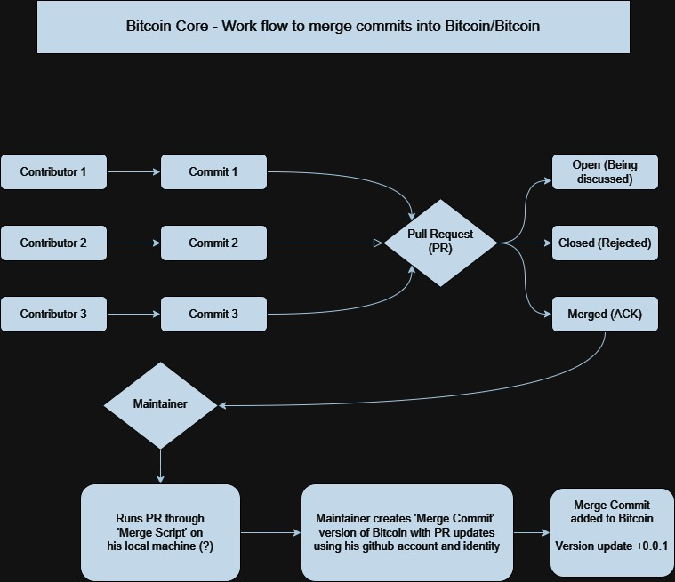

# README

## What is Core Explorer? 
Who watches the watcher? 
Core explorer is an interface to audit and help review Bitcoin core's development process.

As a large scale open source project Bitcoin Core has a lot of contributors and a large code base, which gets a great deal of peer review. But how we know when something falls through the cracks?

The goal of Core Explorer is to systematically review Bitcoin Core contributions, to help identity and rate the leath of the code base as an open source project, strengthen and facilitate it's peer review. 
## Approach?
In order to rate the health of Bitcoin Core's peer review we've identifeid a set of behaviours that signal low amounts of peer review. The most obious of thess are self merges.
- A self merge is when the author of commit that is part or the whole of a pull request is also the maintainer who runs the merge script, or merges the code to the master repo. 

In other words. A self merge happens when a developer is the only known human to have seen code being merged into a code base. If we were going to give that code a rating of peer review based on how many eyeballs it has had on it, it would get a score of 1. The lowest score. 
-- definition

- Health Metrics
-- Health metric 1, self merge ratio: A bad indiction of health  an open source project is  high percantage of code merges coming from the same person that committed them. As there is little to non third party peer review of that code. This risk can be tempered by amount of reviews from other authors, which can be measured in ACKs, among other signs of peer review. 

-- Health metric 2, number of ACKs from contributors: The amount of ACKs commented into the code discussion.

-- Health metric 3, rank of contributor's ACK: ACKs per author could be weighed by the amount of commits and or merges made by that author, so that the ACK process is not trivial to cybil attack.

-- Health metric 4, per line index of self merges: this index rates every line of code merged into bitcoin and ranks them based on whether they were self merged or not.

-- Health metric 5, heat map: worst form of self merge is one with zero “ack”s in the comment section of the pull request. the healthiest form of is a merge is one where the author of the commit differs from the merger, and it has a high number of acks, many of which are from healthy and aged contributors. The heat map would display the lines of code in colors based on quality of merges and reviews. 

## Responsible disclosure? 
- don't reveal the dev until certain
- carefully describe process of identifying smoking gun in self         merge test
- randomized anon id for user data helps to blind us (to some           degree) helps to improve impartiality & hopefuly reduce motivated     reasoning in test creations that we may put forth initially.
  

## Glossary 
Author: human being that is proposing code changes (commits) or merging code

Commit: proposed changes to the master code

Maintainer: someone who has administrative power to merge a commit

Merge: process by which commits are saved to the master code. merges algo are commits and have an author

Feature author: creator of update to bitcoin, in a  pull request

Feature contributors:  contributors to that pull request before it is merged

Merge author: maintainer who runs the pull request thru merge script and merges it

Merge commit: list or collection of commits and changes to the master  code. each merge commit might have multiple pull requests. merge commits don’t update version numbers, only the builds do.

Pull request: collection of commits

-- Official description of contributor work flow https://github.com/bitcoin/bitcoin/blob/master/CONTRIBUTING.md 

-- Difference between author and committer in Git? 
https://stackoverflow.com/questions/18750808/difference-between-author-and-committer-in-git/18754896#18754896

## Dependencies
## Road Map
- V1:  proof of concept, static site
- v2: explorable site
- v3: bitcoin repo expansions? 

TODO: These so far: 
## Usage

Toodles
